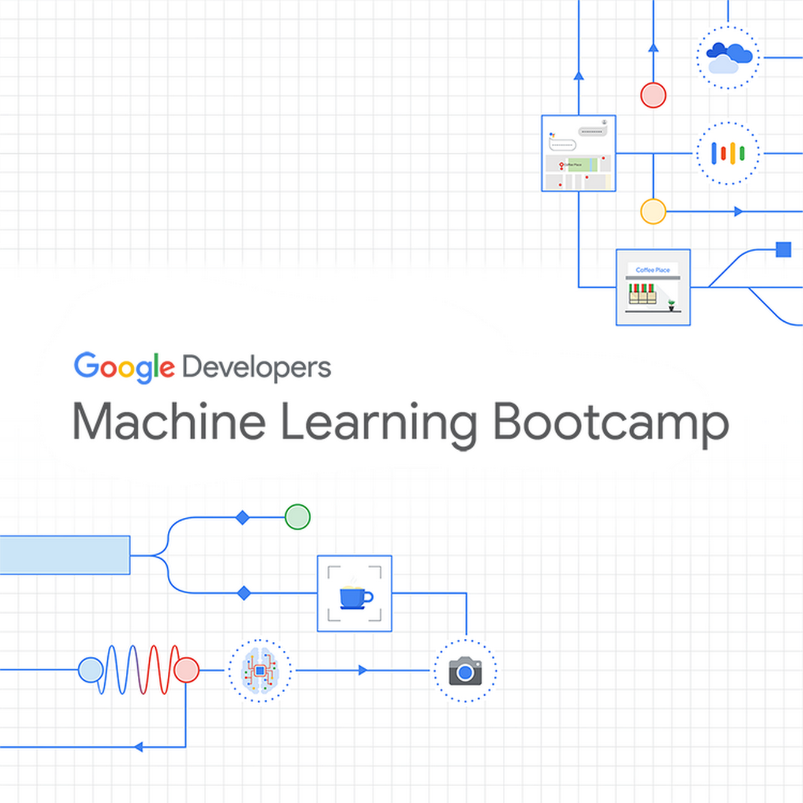

# google-machine-learning-bootcamp

  

## 프로그램 소개
[Google Developers Machine Learning Bootcamp](https://events.withgoogle.com/google-developers-mlb-kr)  
구글 코리아에서는 머신러닝에 관심있는 개발자를 양성하여 관련 인력을 찾고 있는 회사들에 연결해주는 프로그램  

## 일정
### 서류접수
2020-09-15 ~ 2020-09-30  

### Coursera 강의
[mission](mission.md)  
2020-10-16 ~ 2020-12-10  

### 자격증
[certificate](certificate.md)  
2020-10-16 ~ 2021  

### 기타 프로그램
[program](program.md)  
- Tech Talk
- Career Talk
- Office hour

### 채용
[company](company.md)  

