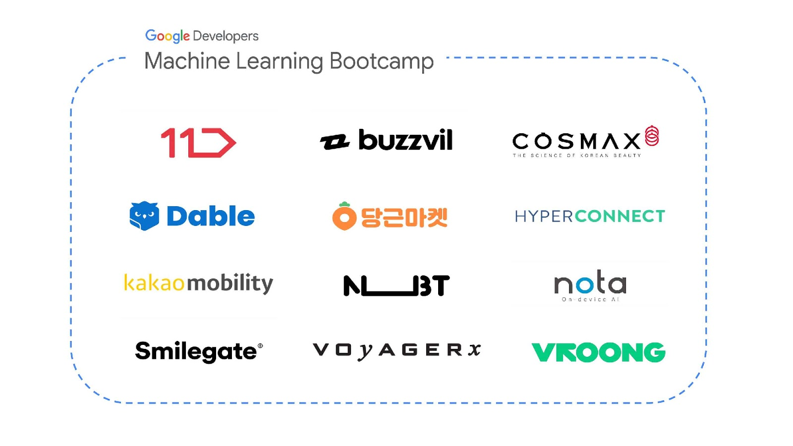

# Company

  

## 머신러닝 회사와의 네트워크 형성 및 취업 연계
Deep Learning Specialization 을 수료하고 3가지 자격증 중 하나의 자격을 취득한 참석자는 Google Developers Machine Learning Bootcamp 수료증 발급 및 참가회사들과 연계하여 인턴쉽/정규직 취업의 기회  

## 채용 정보
회사소개, ML/AI 개발자 주요 업무, 자격요건/우대사항, 혜택 및 복지, 채용 프로세스, 지원양식 등  
대체로 채용공고에 나와있는 내용이기 때문에 생략  

## 11번가

## Buzzvil

## CosMax

## Dable

## Hyper Connect

## Kakao Mobility

## Mesh Korea(Vroong)

## NBT

## Nota

## Smilegate

## Voyger X

## 당근마켓
