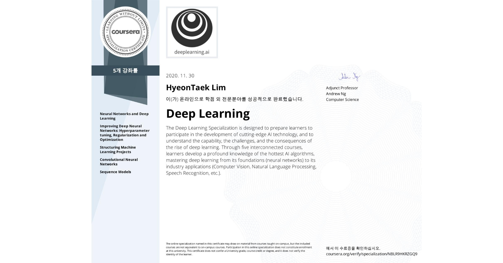

# Mission

  

[Deep Learning Specialization](https://www.coursera.org/specializations/deep-learning)  
수강료 지원  

slack 를 통해 서로 질문, 답변을 하며 스터디 방식으로 진행  

## 마감 일정
- mission1 : 2020-10-16 ~ 2020-10-22 : 1-1 ~ 1-2  
- mission2 : 2020-10-23 ~ 2020-10-29 : 1-3 ~ 1-4  
- mission3 : 2020-10-30 ~ 2020-11-05 : 2-1 ~ 2-1  
- mission4 : 2020-11-06 ~ 2020-11-12 : 2-2 ~ 2-3  
- mission5 : 2020-11-13 ~ 2020-11-19 : 3-1 ~ 4-1  
- mission6 : 2020-11-20 ~ 2020-11-26 : 4-2 ~ 4-3  
- mission7 : 2020-11-27 ~ 2020-12-03 : 4-3 ~ 5-1  
- mission8 : 2020-12-04 ~ 2020-12-10 : 5-2 ~ 5-3  

## 강의 목록
1. 1st course: Neural Networks and Deep Learning
    1. Introduction to deep learning
    1. Neural Networks Basics
    1. Shallow neural networks
    1. Deep Neural Networks
1. 2nd course: Improving Deep Neural Networks: Hyperparameter tuning, Regularization and Optimization
    1. Practical aspects of Deep Learning
    1. Optimization algorithms
    1. Hyperparameter tuning, Batch Normalization and Programming Frameworks
1. 3rd course: Structuring Machine Learning Projects
    1. ML Strategy (1)
    1. ML Strategy (2)
1. 4th course: Convolutional Neural Networks
    1. Foundations of Convolutional Neural Networks
    1. Deep convolutional models: case studies
    1. Object detection
    1. Special applications: Face recognition & Neural style transfer
1. 5th course: Sequence Models
    1. Recurrent Neural Networks
    1. Natural Language Processing & Word Embeddings
    1. Sequence models & Attention mechanism

