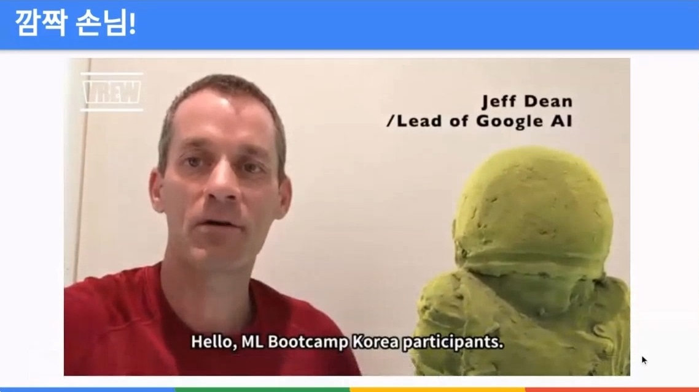
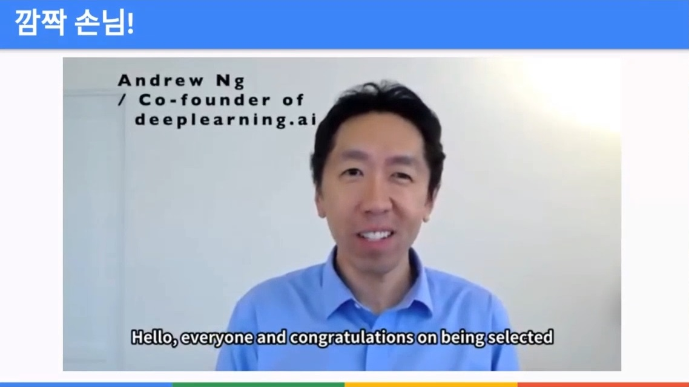
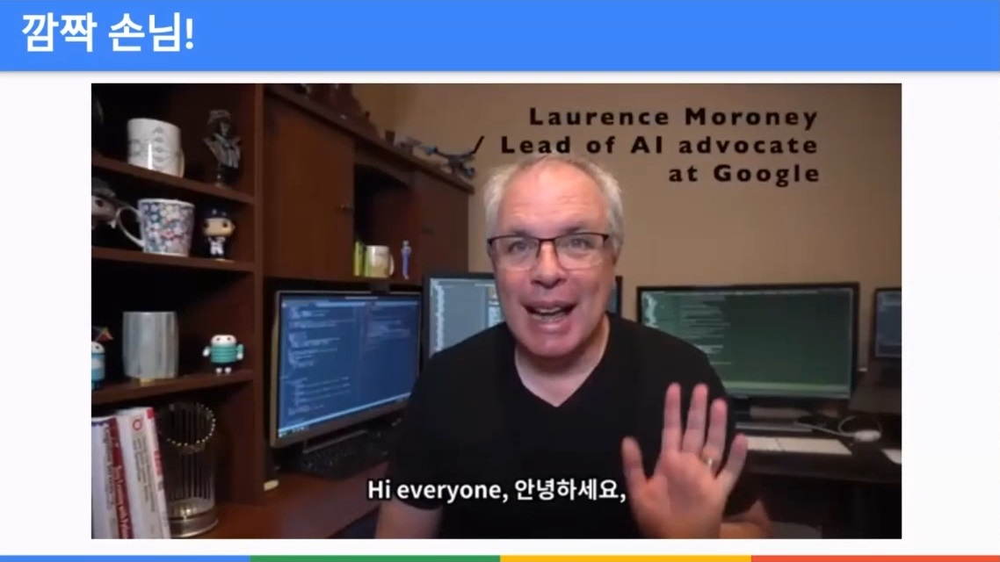

# Meet up

## 프로그램 소개
주 1~2회, 1시간 정도 Google Meet 으로 진행하는 프로그램  

- Meet up
- Tech Talk
- Career Talk
- Office hour

## 운영진
- 권순선 - Global ML Ecosystem Program Lead  
- 유민정 - 구글 개발자 커뮤니티 매니저  

## special guest
특별한 분들의 축하영상 (녹화본)도 볼수있었다.  
(Laurence Moroney 님은 실시간으로 화상회의에도 참여)  

  
  
  

## Talk

### 프로그램 소개
강의, 자격증, 일정, 규칙등의 진행 소개  
일주일에 수십명이 탈락할것이라 예상하셨다고 한다...  
  
한국에서 가장먼저 진행하는 프로그램이라 다른나라(인도, 동남아, 터키)에서도 관심이 많다고 한다.  

### 기업 소개
참가 기업 소개, 인재상, 채용과정, 기술에 대하여 다양하게 들을 수 있었다.  

### Q&A
학위에 대한 질문이 가장 많이 나왔다.  
기업마다 차이는 있었지만 석사 학력이 반드시 있어야 한다고 하는 분은 없었다.  

## 졸업식
코로나가 끝나면 다같이 모여서 맥주 한잔 하는 자리를 만들겠다고 하셨다. (기대중)  
